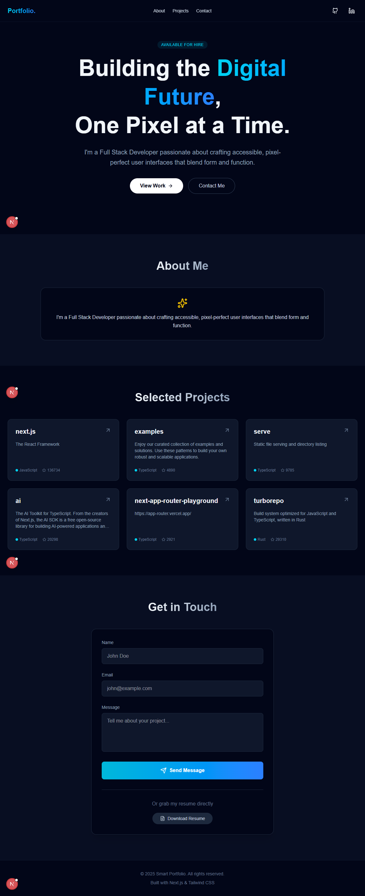

# Hassan Ali - Modern Developer Portfolio



A high-performance, responsive, and visually stunning interactive front-end developer portfolio. Built to showcase modern UI/UX design capabilities through dynamic animations, seamless color scheme toggling, and clean code architecture.

## ✨ Key Features

- **Modern UI/UX Design**: Built with a "dark mode first" approach, using soft glassmorphism, dynamic gradients, and custom Tailwind CSS color variables.
- **GSAP Animations & Micro-interactions**: Utilizes powerful ScrollTrigger animations. Features include a staggered scroll-revealing intro, continuous 360-degree SVG orbiting skill wheels, and scroll-activated project card reveals.
- **Performance Optimized**: Implemented React `lazy` and `Suspense` for below-the-fold components. Replaced intensive programmatic JS logic (like video scrubbing) with GPU-accelerated HTML5 equivalents.
- **Flawless Light/Dark Mode**: A custom Tailwind CSS architecture allows a buttery-smooth switch between elegant light themes and deep, contrasting dark themes.
- **Dynamic Contact Form**: Functional email submission powered by React Actions and error state handling.
- **Fully Responsive**: Adapts flawlessly to mobile devices, tablets, and massive ultra-wide monitors. Includes custom mobile hamburger navigation menus.

## 🚀 Recent Updates & Changes

- **Performance Overhaul**: Implemented React `lazy` and `Suspense` for all below-the-fold components (About, Skills, Projects, Contact), drastically reducing initial bundle size and improving site rendering speed.
- **Debounced Resizing**: Added proper cleanup and a 150ms debounce function to the `window.resize` event listener in `App.jsx`, preventing UI stuttering and memory leaks during viewport changes.
- **Hero Video Optimization**: Stripped out CPU-intensive GSAP scroll-scrubbing tied to video playback. Scaled down to native HTML5 GPU-accelerated auto-play attributes for a flawlessly smooth first impression. 
- **GSAP Tweaks**: Changed the Hero GSAP animations to run `once: true`. Preventing annoying backward re-animations on simple up-scrolls and ensuring a premium feel.
- **Skills Orbit Interaction**: Replaced the static skills grid with a beautiful, fully mathematically computed circular orbit animation. SVGs rotate synchronously to remain upright while continuing to circle endlessly along a dashed track. Auto-pauses on hover.
- **About Section Redesign**: Removed bulky images and simplified the layout to a centralized, text-focused aesthetic, resulting in cleaner read flow.
- **Design Touches**: 
  - Finetuned padding (`py-20`) between the completely revamped Projects section and the Contact form.
  - Resolved low-contrast text and border rendering issues in both Light Mode (`bg-light-primary`) and Dark Mode (`bg-dark-primary`).
  - Synced new visual data placeholders (morent3d.png, cocktail.png).

## 🛠️ Tech Stack Included

*   **Framework**: [React](https://react.dev/) + [Vite](https://vitejs.dev/)
*   **Styling**: [Tailwind CSS v4](https://tailwindcss.com/)
*   **Animations**: [GSAP](https://gsap.com/) + [ScrollTrigger](https://gsap.com/docs/v3/Plugins/ScrollTrigger/)
*   **Icons**: [React Icons](https://react-icons.github.io/react-icons/)
*   **Navigation**: [React Scroll](https://www.npmjs.com/package/react-scroll)

## 🚀 Getting Started

To run this project locally, simply follow these steps.

### Prerequisites
Make sure you have Node JS installed on your machine.

### Installation

1. Clone the repository
```bash
git clone https://github.com/IramGillani/Hassan-Space.git
```

2. Navigate to the project directory
```bash
cd Hassan-Space
```

3. Install the dependencies
```bash
npm install
```

4. Start the development server
```bash
npm run dev
```

The server will typically start at `http://localhost:5173`.

## 📂 Project Structure Overview

```text
├── public/                 # Static assets (images, videos)
├── src/
│   ├── actions/            # Server actions / Form handling
│   ├── components/         # Reusable UI components (Hero, About, Projects)
│   ├── App.jsx             # Main application orchestrator & routing
│   ├── data.jsx            # Centralized content data (projects, skills, links)
│   └── index.css           # Global styles and Tailwind configuration
├── tailwind.config.js      # Tailwind customization
└── README.md
```

## 📬 Contact 

Feel free to connect or reach out!
*   **GitHub**: [@IramGillani](https://github.com/IramGillani)

---
*Crafted with precision by Hassan Ali*
